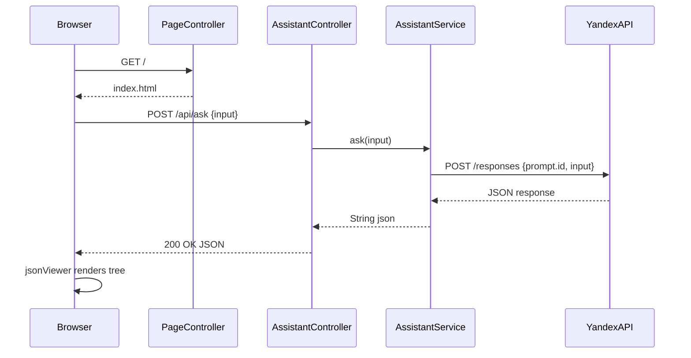

# Architecture Plan: Yandex Assistant Web UI (Java 21 + Spring Boot)

## Overview

A single-page Spring Boot web application that provides a full-width HTML form to send messages to the Yandex Cloud Assistant REST API (OpenAI-compatible) and renders the JSON response as an interactive tree using the **JSONView** browser plugin pattern (embedded via CDN).

---

## Technology Stack

| Layer | Technology |
|---|---|
| Language | Java 21 |
| Framework | Spring Boot 3.4.x |
| Build | Maven 3.9+ |
| HTTP Client | Spring WebFlux `WebClient` (reactive, non-blocking) |
| Template Engine | Thymeleaf (serves `index.html`) |
| Frontend | Vanilla HTML/CSS + [jquery.json-viewer](https://github.com/abodelot/jquery.json-viewer) via CDN |
| Config | `application.yml` + `@ConfigurationProperties` |
| Test | JUnit 5 + MockWebServer (OkHttp) |

> **JSON tree plugin choice:** [`jquery.json-viewer`](https://github.com/abodelot/jquery.json-viewer) — lightweight, zero-dependency (only jQuery), renders JSON as a collapsible tree with syntax highlighting. Available via jsDelivr CDN. Alternative: `jsoneditor` (heavier, more features).

---

## Project Structure

```
profpat-api-test/
├── pom.xml
└── src/
    ├── main/
    │   ├── java/
    │   │   └── com/example/assistant/
    │   │       ├── AssistantApplication.java          # @SpringBootApplication
    │   │       ├── config/
    │   │       │   ├── YandexAssistantProperties.java # @ConfigurationProperties
    │   │       │   └── WebClientConfig.java           # WebClient bean
    │   │       ├── controller/
    │   │       │   ├── PageController.java            # GET / → index.html
    │   │       │   └── AssistantController.java       # POST /api/ask
    │   │       ├── dto/
    │   │       │   ├── AskRequest.java                # { "input": "..." }
    │   │       │   └── AskResponse.java               # raw JSON from Yandex
    │   │       └── service/
    │   │           └── AssistantService.java          # calls Yandex API
    │   └── resources/
    │       ├── application.yml
    │       └── templates/
    │           └── index.html
    └── test/
        └── java/
            └── com/example/assistant/
                └── service/
                    └── AssistantServiceTest.java
```

---

## Configuration (`application.yml`)

All Yandex-specific parameters are externalized:

```yaml
server:
  port: 8080

yandex:
  assistant:
    api-key: ${YANDEX_CLOUD_API_KEY}   # injected from env var
    base-url: https://rest-assistant.api.cloud.yandex.net/v1
    project: b1gi87p3set9k84higrm
    prompt-id: fvtcjnqtqendn7goq1ft
```

`api-key` uses Spring's `${ENV_VAR}` placeholder so the secret is never hardcoded.

---

## Key Classes

### `YandexAssistantProperties`
```java
@ConfigurationProperties(prefix = "yandex.assistant")
public record YandexAssistantProperties(
    String apiKey,
    String baseUrl,
    String project,
    String promptId
) {}
```

### `WebClientConfig`
Builds a `WebClient` pre-configured with `baseUrl`, `Authorization: Bearer <apiKey>`, and `x-folder-id: <project>` headers.

### `AssistantService.ask(String input)`
Calls `POST /responses` with body:
```json
{
  "prompt": { "id": "<promptId>" },
  "input": "<user message>"
}
```
Returns the raw response body as `String` (JSON), which is passed directly to the frontend for tree rendering.

### `AssistantController`
```
POST /api/ask
Content-Type: application/json
Body: { "input": "some message" }

Response: 200 OK, Content-Type: application/json
Body: <raw Yandex API JSON response>
```

### `PageController`
```
GET /  →  renders templates/index.html via Thymeleaf
```

---

## Frontend (`index.html`)

- Full-width form with a `<textarea>` for input and a **Send** button
- On submit: `fetch('/api/ask', { method: 'POST', body: JSON.stringify({input}) })`
- Response rendered as collapsible JSON tree using **jquery.json-viewer** (jsDelivr CDN)
- Loading spinner shown during request
- Error messages displayed inline

### CDN dependencies (no npm/build step needed)
```html
<!-- jQuery (required by json-viewer) -->
<script src="https://cdn.jsdelivr.net/npm/jquery@3.7.1/dist/jquery.min.js"></script>
<!-- jquery.json-viewer -->
<link rel="stylesheet" href="https://cdn.jsdelivr.net/npm/jquery.json-viewer@1.4.0/json-viewer/jquery.json-viewer.css">
<script src="https://cdn.jsdelivr.net/npm/jquery.json-viewer@1.4.0/json-viewer/jquery.json-viewer.js"></script>
```

Usage:
```js
$('#json-display').jsonViewer(responseJson, { collapsed: false, withQuotes: true });
```

---

## Request Flow



---

## Maven Dependencies (`pom.xml`)

```xml
<parent>
    <groupId>org.springframework.boot</groupId>
    <artifactId>spring-boot-starter-parent</artifactId>
    <version>3.4.3</version>
</parent>

<dependencies>
    <!-- Web MVC for PageController -->
    <dependency>spring-boot-starter-web</dependency>
    <!-- WebClient (reactive HTTP client) -->
    <dependency>spring-boot-starter-webflux</dependency>
    <!-- Thymeleaf templates -->
    <dependency>spring-boot-starter-thymeleaf</dependency>
    <!-- @ConfigurationProperties validation -->
    <dependency>spring-boot-configuration-processor</dependency>
    <!-- Tests -->
    <dependency>spring-boot-starter-test</dependency>
    <dependency>com.squareup.okhttp3:mockwebserver:4.12.0</dependency>
</dependencies>
```

> Note: `spring-boot-starter-web` and `spring-boot-starter-webflux` can coexist — Spring Boot will use the Servlet stack for MVC while `WebClient` is used only as an HTTP client.

---

## Test Strategy

`AssistantServiceTest` uses **MockWebServer** (OkHttp) to:
1. Enqueue a mock JSON response
2. Call `AssistantService.ask("test message")`
3. Assert the HTTP request sent to MockWebServer has correct path, headers, and body
4. Assert the returned string equals the mock response

---

## Todo List (Implementation Order)

1. Create `pom.xml` with Java 21, Spring Boot 3.4.3, all dependencies
2. Create `application.yml` with all externalized config
3. Create `AssistantApplication.java`
4. Create `YandexAssistantProperties.java`
5. Create `WebClientConfig.java`
6. Create `AskRequest.java` / `AskResponse.java` DTOs
7. Create `AssistantService.java`
8. Create `AssistantController.java`
9. Create `PageController.java`
10. Create `index.html` with full-width form + jquery.json-viewer
11. Create `AssistantServiceTest.java`
